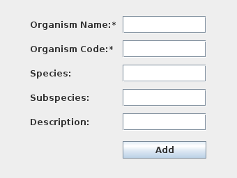
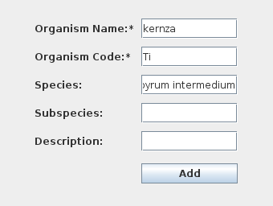

# Root System Architecture, General Image Analysis GUI

The RSA-GIA pipeline is the Topp Lab’s image processing pipeline for plants
grown in a gel-based medium. The input is a set of images from the gel system.
The output is a csv file of traits calculated from image processing.

The pipeline acts a wrapper for the underlying CLI tools that have been
developed over the years. Some of these tools have GUI versions as well, such
as GiaRoots, which is referred to as Gia2D in the RSA-GIA pipeline.

This application is written in Java, and it was designed to run on a Linux
system, namely CentOS. As such, installation and development guides will assume
you are working in a Linux-based operating system.

The current maintainer is Tim Parker <<tparker@danforthcenter.org>>.

---

## Table of Contents

* [System Structure](#system-structure)
* [Installation](#installation)
* [Administration](#administration)
  * [Add new user](#add-new-user)
  * [Add new species](#add-new-species)
  * [Upload data](#upload-data)
  * _[Archive data](#archive-data) (planned)_
* [Development](#development)
  * [Dependencies](#dependencies)
    * [RHEL-based, CentOS Dependency Installation Guide](#rhel-based-centos-dependency-installation-guide)
    * [Debian-based, Ubuntu Dependency Installation Guide](#debian-based-ubuntu-dependency-installation-guide)
  * [Build](#build)
  * [Configure MySQL Server](#mysql-configuration)
* [Troubleshooting](#troubleshooting)
  * [Missing Python Packages](#missing-python-packages)
  * [Could not connect to database](#could-not-connect-to-database)
  * [PrincipalUser Error](#principaluser-error)
  * [java.nio.file.attribute.UserPrincipalNotFoundException](#java.nio.file.attribute.UserPrincipalNotFoundException)
  * [rsa-mv2orig-launcher](#rsa-mv2orig-launcher)
  * [Invalid Species](#invalid-species)
  * [File not found in processed_images](#file-not-found-in-processed_images)
  * [Create Image Thumbnail Modal Frozen](#create-image-thumbnail-modal-frozen)
  * [OutputInfoDBFunctions.findMaxRunID() Error](#outputinfodbfunctions.findmaxrunid-error)
  * [Gia2D - No configuration are available](#gia2d---no-configuration-are-available)
  * [QC2 error, cannot find “*thresholded_composite.png”](#qc2-error,-cannot-find-*thresholded_composite.png”)
  * [Gia2D - ERROR 139](#gia2d---error-139)

---

## Installation

A guide on installing and configuring an instance of RSA-GiA is provided in
provided in [INSTALL](INSTALL.md). For development and testing, we recommend
using a virtual machine instead. A guide on setting up a VirtualBox-based VM is
provided in [doc/virtual-machine-setup.md](doc/virtual-machine-setup.md)

## Administration

### Add new user

1. Create data folder and set permissions

    ```bash
    mkdir -pv /data/rsa/to_sort/root /data/rsa/to_sort/username
    chown -Rv rsa-data:rootarch /data/rsa/to_sort/username
    chmod -Rv u+rwx,g+rxs,o+rx /data/rsa/to_sort/username
    ```

2. Put in request to add user to rootarch group

    This requires the Data Science Facility (Josh or Noah) to add them, as they maintain the authentication server for the Center's cluster.

3. [Optional] Update Gel Imaging File Manager (GIFM) to include new user as project head

    Conventionally, we have only had project leads and developers as project heads as defined by the GIFM. However, if time permits, adding everyone as a project head does allow for more precise control and tracking of how data is processed.

### Add new species

1. Open `rsa-gia` and navigate to the menu `Add Metadata > Add Organism`.

    The following window will appear:

    

1. Fill in the appropriate values for the required fields

    Here is an example of kernza:

    

    > **Warning**
    > The file naming convention is strict. For the _organism name_, use all lowercase letters. That's only letters, no numbers, spaces, or special characters. The _organism code_ must be a two letter code, first letter is capitalized and the second letter is lowercase. This is typically the initials of the scientific name. Although not required, as a convention, the full scientific name is used for the _species_ field.

1. Add species code and organism name to `default.properties`. Typically, this is installed in the filepath `/etc/opt/rsa-gia/default.properties`. You need append the new species to the comma delimited lists for `species_names` and `species_codes`.

    Here is an example.

    ```properties
    species_names=corn,model,rice,pennycress,insilico,millet,sorghum,brachypodium,alfalfa,Sviridis,Sitalica,arabidopsis,winterbarley,hairyvetch,purpletopturnip,commonbean,kernza
    species_codes=Zm,Fk,Os,Ta,Is,Gm,Sb,Bd,Ms,Sv,Si,At,Hv,Vv,Bc,Pv,Ti
    ```

    > **Warning**
    > Keep in mind that both the species name and code must be unique.

### Upload data

<https://github.com/Topp-Roots-Lab/gel-imaging-file-manager.git>

File uploads are handled by a separate Python script, the  _Gel Imaging File Manager_. It is a minimalist script that uploads a copy of imaging data from  the workstation to our storage on the Center's cluster and then adjusts the files' ownership and permissions to comply with restrictions required by `rsa-gia`.

### Archive data

Currently, we need to discuss and decide how the data should be archived. Since the datasets are managed by an external database, if the files were to be moved, then there would likely be a mismatch and may break the system.

## Development

### Dependencies

#### RHEL-based, CentOS Dependency Installation Guide

* [Java SE Development Kit 8u45](https://www.oracle.com/technetwork/java/javase/downloads/java-archive-javase8-2177648.html) (Requires Oracle account)
* [Python 2.x](https://www.python.org/downloads/)
* A Java IDE (We recommend [IntelliJ](https://www.jetbrains.com/idea/))
* [MySQL Server](https://www.digitalocean.com/community/tutorials/how-to-install-mysql-on-centos-7)

```bash
# Install Java
# (Manual) Download Java SE Development Kit 8u202
# https://www.oracle.com/technetwork/java/javase/downloads/java-archive-javase8-2177648.html

# Install JDK
sudo mkdir -p /usr/lib/jvm
sudo tar -zxvf jdk-8u202-linux-x64.tar.gz -C /usr/lib/jvm/

# (Optional) Set JRE as default alternative
sudo alternatives --install /usr/bin/java java /usr/lib/jvm/jdk1.8.0_202/bin/java 100
sudo alternatives --set java /usr/lib/jvm/jdk1.8.0_202/bin/java

## Install MySQL
sudo apt update
sudo apt install mysql-server
## Initialize MySQL server
### Enter a new password for root user when prompted
sudo mysql_secure_installation

```

#### Debian-based, Ubuntu Dependency Installation Guide

* [Java SE Development Kit 8u202](https://www.oracle.com/technetwork/java/javase/downloads/java-archive-javase8-2177648.html) (Requires Oracle account)
* [Python 2.x](https://www.python.org/downloads/)
* A Java IDE ([IntelliJ](https://www.jetbrains.com/idea/) recommended)
* [MySQL Server](https://www.digitalocean.com/community/tutorials/how-to-install-mysql-on-ubuntu-18-04)

```bash
# Install Java
# (Manual) Download Java SE Development Kit 8u202
# https://www.oracle.com/technetwork/java/javase/downloads/java-archive-javase8-2177648.html

# Install JDK
sudo mkdir -p /usr/lib/jvm
sudo tar -zxvf jdk-8u202-linux-x64.tar.gz -C /usr/lib/jvm/

# (Optional) Set JRE as default alternative
sudo update-alternatives --install /usr/bin/java java /usr/lib/jvm/jdk1.8.0.202/bin/java 100
sudo update-alternatives --set java /usr/lib/jvm/jdk1.8.0_202/bin/java

# Install MySQL
wget https://dev.mysql.com/get/mysql80-community-release-el7-3.noarch.rpm
sudo rpm -ivh mysql80-community-release-el7-3.noarch.rpm
sudo yum install mysql-server
sudo systemctl start mysqld
sudo systemctl enable mysqld
sudo systemctl status mysqld
## Locate the temporary password assigned to root user
sudo grep 'temporary password' /var/log/mysqld.log
## Initialize MySQL server
### Enter temporary password assigned when prompted
sudo mysql_secure_installation
```

#### Build

Maven is used to manage the project's dependencies and can be used to compile and package it.

#### Java Package: `rsa-gui.jar`

**Note**: If you follow the installation guide, then the `.jar` included is named `rsa-gia*.jar` instead.

If you want to package the project for use, navigate to your clone of this repo and then run the following Maven command:

```bash
mvn clean package
```

#### MySQL Configuration

Log into MySQL

```bash
sudo mysql
```

The following command will set up your MySQL connection to be the placeholder
values. If you want to change these, you will need to alter them in the source
code. The *username* and *password* are defined within the file
`src/main/java/org/danforthcenter/genome/rootarch/rsagia/app2/App.java`. You will need to
repackage `rsa-gia.jar` to adjust the username or password. If you have an
existing rsa-gia.jar in use, make sure to replace it with the newly built one.
We suggest using IntelliJ with Maven to repackage it.

|Key|Default Value|
|-|-|
|db_server|`localhost`|
|db_name|`rsa_gia`|
|username|`rsa-gia`|
|password|`rsagia`|

```sql
-- Change root user password
ALTER USER 'root'@'localhost' IDENTIFIED WITH mysql_native_password BY 'password';
-- Create user for application & set permissions
CREATE USER 'rsa-gia'@'%' IDENTIFIED WITH mysql_native_password BY 'rsagia';
-- Create database to store application data
CREATE DATABASE rsa_gia;
GRANT ALL PRIVILEGES ON rsa_gia.* to 'rsa-gia'@'%';
FLUSH PRIVILEGES;
-- Adjust GROUP BY mode
SET GLOBAL sql_mode=(SELECT REPLACE(@@sql_mode,'ONLY_FULL_GROUP_BY',''));
```

##### Import MySQL Database Schema

The schema for the database that tracks usage is stored at `src/resources/schema.sql`

```bash
mysql -u 'rsa-gia' --password='rsagia' --database=rsa_gia < src/resources/schema.sql
```

#### Future Plans

1. Migrate Python scripts to Python 3.8+
2. Add documenation on compiling individual components from source

#### Troubleshooting

##### Could not connect to database

* Verify that the `db_server` and `db_name` are correct in `src/main/java/org/danforthcenter/genome/rootarch/rsagia/app2/App.java`.

  |Key|Default Value|
  |-|-|
  |db_server|`localhost`|
  |db_name|`rsa_gia`|

* Make sure that the user used to connect to the database (default: `rsa-gia`) is
identified by `mysql_native_password`. If you created the application's user
using another plugin such as `caching_sha2_password`, then you will need to 
alter the user. Log into your MySQL server with the appropriate permissions and
change the password for said user.

  ```sql
  ALTER USER 'username'@'localhost' IDENTIFIED WITH mysql_native_password BY 'password';
  ```

  |Default Key| Default Value|
  |-|-|
  |Username| `rsa-gia` |
  |Password| `rsagia` |

##### PrincipalUser Error

Create rsa-data user and rootarch group and then chown dataset to that both own the data.

##### java.nio.file.attribute.UserPrincipalNotFoundException

Make sure that the dir_group and file_group in `default.properties` are set to rootarch, or at least to the group you have set to manage the data. The default is `rootarch`.

##### rsa-mv2orig-launcher

* Incorrect ownership or permissions

  Recompile and modify permissions

    ```bash
    g++ /opt/rsa-gia/bin/importer/rsa-mv2orig-launcher.cpp -o /opt/rsa-gia/bin/importer/rsa-mv2orig-launcher
    chown -v rsa-data:rootarch /opt/rsa-gia/bin/importer/rsa-mv2orig-launcher
    chmod -v 4750 /opt/rsa-gia/bin/importer/rsa-mv2orig-launcher
    chmod -v +x /opt/rsa-gia/bin/importer/rsa-mv2orig.py
    ```

* `../data/.../to_sort/username` does not exist

    Make sure that the user's data folder was created and has the correct permissions (`rsa-data:rootarch`).
    If this is a new installation, make sure to have run `rsa-create-orig` as root during the RSA-GiA installation.

* ERROR: cannot open file /tmp/allowed_organism28734873264782364786234.txt for reading

    Make sure that the user running the RSA-GiA application is a member of the **rootarch** group.

    It's common for the rootarch group to not be added to the root user. If for some reason your need to run the application as root, you can use the `newgrp` command to temporarily add the group to the user account.

    ```bash
    newgrp rootarch
    ```

##### Invalid Species

Add organism to database via the application.

NOTE(tparker): It appears that the values stored in default.properties are not longer used. (This code should be removed or at least deprecated)

##### File not found in processed_images

Make sure that the user's data folder was created and has the correct permissions (`rsa-data:rootarch`).
If this is a new installation, make sure to have run `rsa-create-orig` as root during the RSA-GiA installation.

##### Create Image Thumbnail Modal Frozen

It appears to be several issues, but it boiled down to there be a null pointer exception for the experiment run ID since the files had never been run before

##### OutputInfoDBFunctions.findMaxRunID() Error

```bash
java.lang.NullPointerException at org.danforthcenter.genome.rootarch.rsagia.dbfunctions.OutputInfoDBFunctions.findMaxRunID(OutputInfoDBFunctions.java:48)
java.lang.IndexOutOfBoundsException: Index: 0, Size: 0
	at java.util.ArrayList.rangeCheck(ArrayList.java:653)
	at java.util.ArrayList.get(ArrayList.java:429)
	at org.jooq.impl.ResultImpl.get(ResultImpl.java:2997)
	at org.jooq.impl.ResultImpl.getValue(ResultImpl.java:314)
	at org.danforthcenter.genome.rootarch.rsagia.dbfunctions.OutputInfoDBFunctions.findAppID(OutputInfoDBFunctions.java:65)
    at org.danforthcenter.genome.rootarch.rsagia.dbfunctions.OutputInfoDBFunctions.insertProgramRunTable(OutputInfoDBFunctions.java:71)
	at org.danforthcenter.genome.rootarch.rsagia.app2.CompositeImageWorker.doInBackground(CompositeImageWorker.java:64)
	at org.danforthcenter.genome.rootarch.rsagia.app2.CompositeImageWorker.doInBackground(CompositeImageWorker.java:23)
```

This error is a suspected bug that occurs when the database has not been initialized. One workaround is to import an older backup of the production server into an empty database instance.

##### Gia2D - No configuration are available

Same issue as the findMaxRunID is missing, you need to initialize it with existing configurations.

```sql
insert
	into
	program (name,
	description,
	config_format)
values ('scale',null,null),('crop',null,null),('giaroot_2d',null,'xml'),('rootwork_3d',null,null),('rootwork_3d_perspective',null,null),('gia3d_v2',null,'xml'),('qc',null,null),('qc2',null,null),('qc3',null,null);
```

##### QC2 error, cannot find “*thresholded_composite.png”

The Python script for running QC is erroring silently. In my case, the library “Pillow” was missing.

```bash
pip2 install Pillow
# OR
python2 -m pip install Pillow
```

##### Gia2D - ERROR 139

Make sure that `rsa-gia/gia/gia.log` exists and has a minimum of `644` permissions on it. If you followed the installation guide, you should have created a symlink to `/var/log/rsa-gia/gia.log` with `664` permissions, group set to `rootarch`.
