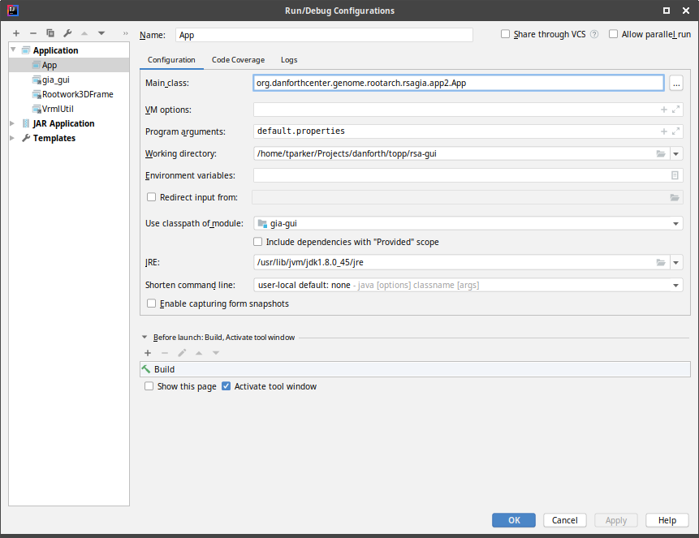
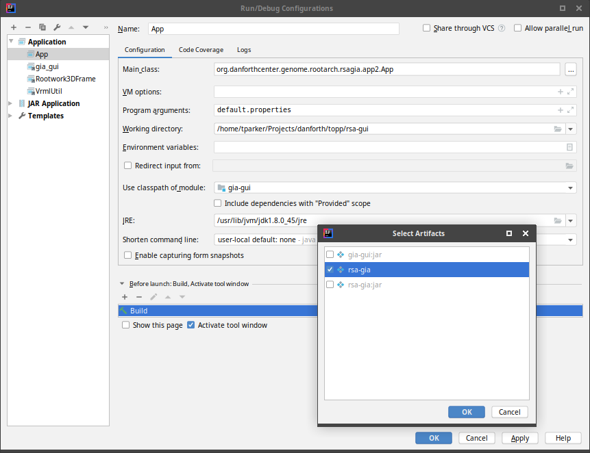
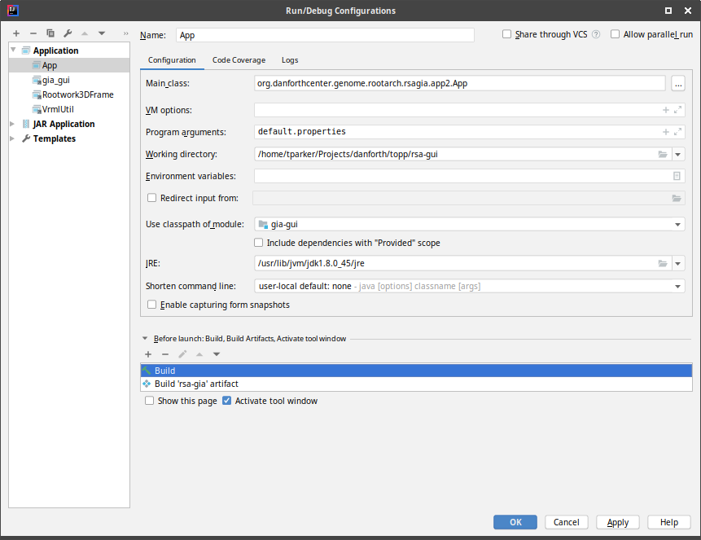

# Root System Architecture, General Image Analysis GUI

The RSA-GIA pipeline is the Topp Lab’s image processing pipeline for plants grown in a gel-based mediam. There are a number of different processing algorithms that are included in the pipeline.  The input is a set of images from the gel system. The output is a csv file of traits calculated from image processing.

Although because this appilcation is written in Java, it was designed to run on a Linux system, namely CentOS. Installation and development guides will assume you are working in a Linux-based operating system.

---

## Table of Contents
* [System Structure](#system-structure)
* [Installation](#installation)
  * [CentOS 8](#centos-8)
* [Testing](#testing)
* [Administration](#administration)
  * [Add new user](#add-new-user)
  * [Upload data](#upload-data)
  * ~~[Archive data](#archive-data)~~
* [Development](#development)
  * [Dependencies](#dependencies)
    * [RHEL-based, CentOS Dependency Installation Guide](#rhel-based-centos-dependency-installation-guide)
    * [Debian-based, Ubuntu Dependency Installation Guide](#debian-based-ubuntu-dependency-installation-guide)
  * [Building Project](#building-project)
  * [Configure MySQL Server](#mysql-configuration)
* [Troubleshooting](#troubleshooting)
  * [Missing Python Packages](#missing-python-packages)
  * [Could not connect to database](#could-not-connect-to-database)
  * [PrinicpalUser Error](#prinicpaluser-error)
  * [java.nio.file.attribute.UserPrincipalNotFoundException](#java.nio.file.attribute.UserPrincipalNotFoundException)
  * [rsa-mv2orig-launcher](#rsa-mv2orig-launcher)
  * [Invalid Species](#invalid-species)
  * [File not found in processed_images](#file-not-found-in-processed_images)
  * [Create Image Thumbnail Modal Frozen](#create-image-thumbnail-modal-frozen)
  * [OutputInfoDBFunctions.findMaxRunID() Error](#outputinfodbfunctions.findmaxrunid-error)
  * [Gia2D - No configuration are available](#gia2d---no-configuration-are-available)
  * [QC2 error, cannot find “*thresholded_composite.png”](#qc2-error,-cannot-find-*thresholded_composite.png”)

---

## System Structure

In order to install and use this application, you will need to install or
configure the following components onto a system.

- [Java SE Runtime Environment 8u202](https://www.oracle.com/technetwork/java/javase/downloads/java-archive-javase8-2177648.html)
- [Build Project]()*
- [Python 2.7.x](https://www.python.org/downloads/)

*Note, some binaries can be copied directly from another server's installation

## Installation
Below is a full installation on how to install RSA-GiA onto a barebones instance
of an operating system. This includes group creation, changes to file system
hierarchy, dependency installation, configuration of properties file, and
compiling sub-components.

### CentOS 8

Use the following commands to update the system and install dependencies
```bash
# Clone this repo for distribution files
git clone https://github.com/Topp-Roots-Lab/rsa-gui.git

# Install dependencies for RSA-GiA
dnf install -y ImageMagick

# Gia2d Dependency: png12, tiff
# https://centos.pkgs.org/8/centos-appstream-x86_64/libpng12-1.2.57-5.el8.x86_64.rpm.html
dnf install -y libpng12

# Libpng15
git clone https://github.com/glennrp/libpng.git --branch libpng15 --single-branch && cd libpng
./configure --exec-prefix=/usr --libdir=/lib64
make && make check && make install && cd ..

# libtiff3
# Compile libtiff3 (http://www.libtiff.org/)
wget http://download.osgeo.org/libtiff/tiff-3.9.7.tar.gz
tar -zvxf tiff-3.9.7.tar.gz && cd tiff-3.9.7/
./configure --exec-prefix=/usr --libdir=/lib64
make && make check && make install && cd ..

# Qt4
# https://github.com/qt/qt.git

# Qt4 Dependencies
# https://doc.qt.io/archives/qt-4.8/requirements-x11.html
# NOTE(tparker): There is not an entry for libglib-2.0 or libpthread
# As far as I can tell the glibc-devel provides the necessary libraries for libglib-2.0
# And libpthread appears to already be installed by default for CentOS 8
# I added (libXtst-devel) because of https://www.programering.com/a/MjM3kjNwATA.html
dnf install -y libXrender-devel libXrandr-devel libXfixes-devel libXinerama-devel fontconfig-devel freetype-devel libXi-devel libXt-devel libXext-devel libX11-devel libSM-devel libICE-devel glibc-devel libXtst-devel

wget http://download.qt.io/archive/qt/4.8/4.8.7/qt-everywhere-opensource-src-4.8.7.tar.gz
tar -zxvf qt-everywhere-opensource-src-4.8.7.tar.gz && cd qt-everywhere-opensource-src-4.8.7/
echo 'yes' | ./configure  -opensource -shared -no-pch -no-javascript-jit -no-script

# Currently, there is a known bug with a cast in the itemview.cpp file
sed -i 's|view()->selectionModel()->select(index, QItemSelectionModel::Columns \& QItemSelectionModel::Deselect);|view()->selectionModel()->select(index, static_cast<QItemSelectionModel::SelectionFlags>(QItemSelectionModel::Columns \& QItemSelectionModel::Deselect));|g' ./src/plugins/accessible/widgets/itemviews.cpp
gmake -j4
gmake install
ln -s /usr/local/Trolltech/Qt-4.8.7/lib/libQtCore.so.4 /usr/lib64/libQtCore.so.4
cd ..

# Create installation folder
mkdir -pv /opt/rsa-gia/bin /etc/opt/rsa-gia /var/log/rsa-gia
chown -Rv :rootarch /var/log/rsa-gia
chmod -Rv 775 /var/log/rsa-gia

# Copies of binaries from CentOS 6 instance of Viper
cp -Rv rsa-gui/dist/centos6-binaries/* /opt/rsa-gia/bin

# Add java to system path in /etc/profile.d
echo 'export PATH="$PATH:/opt/java/java_default/bin:/opt/rsa-gia/bin"' > /etc/profile.d/rsagia.sh
echo 'export JAVA_HOME=/usr/java/jdk1.8.0_45' >> /etc/profile.d/rsagia.sh
source /etc/profile.d/rsagia.sh

# Install file manager tools
git clone https://github.com/Topp-Roots-Lab/rsa-tools.git
pip2 install -r rsa-tools/requirements.txt
mkdir -pv /opt/rsa-gia/bin/importer /opt/rsa-gia/bin/file-handlers /opt/rsa-gia/bin/gia-programs/quality-control/qc
cp -Rv rsa-tools/Importer/* /opt/rsa-gia/bin/importer/
cp -Rv rsa-tools/FileHandlers/* /opt/rsa-gia/bin/file-handlers/
cp -Rv rsa-tools/QualityControl/* /opt/rsa-gia/bin/gia-programs/quality-control/qc/

# Compile permission elevation scripts and set setuid
g++ /opt/rsa-gia/bin/importer/rsa-mv2orig-launcher.cpp -o /opt/rsa-gia/bin/importer/rsa-mv2orig-launcher
chown -v rsa-data:rootarch /opt/rsa-gia/bin/importer/rsa-mv2orig-launcher
chmod -v 4750 /opt/rsa-gia/bin/importer/rsa-mv2orig-launcher
chmod -v +x /opt/rsa-gia/bin/importer/rsa-mv2orig.py

g++ /opt/rsa-gia/bin/file-handlers/rsa-renameorig-launcher.cpp -o /opt/rsa-gia/bin/file-handlers/rsa-renameorig-launcher
chown -v rsa-data:rootarch /opt/rsa-gia/bin/file-handlers/rsa-renameorig-launcher
chmod -v 4750 /opt/rsa-gia/bin/file-handlers/rsa-renameorig-launcher
chmod -v +x /opt/rsa-gia/bin/file-handlers/rsa-renameorig.py

chown -v rsa-data:rootarch /opt/rsa-gia/bin/gia-programs/quality-control/qc/all_qc_folder.py
chmod -v +x /opt/rsa-gia/bin/gia-programs/quality-control/qc/all_qc_folder.py

# Setup data folders and set ownership & permissions
rsa-create-orig
echo 'yes' | rsa-setrights-orig
echo 'yes' | rsa-setrights-proc
chown -Rc rsa-data:rootarch /data
chmod -Rv a-x+X,u-x+rwX,g-swx+rwX,o-wx+rX /data

# Install templates into data folder
src_tmplt='/opt/rsa-gia/bin/rsa-gia-templates/*'
dest_tmplt='/data/rsa/rsa-gia-templates'
chown -v rsa-data:rootarch "$dest_tmplt"
chmod -v 2750 "$dest_tmplt"
cp -Rv $src_tmplt $dest_tmplt
# Add in extra templates
yes | cp -Rvf rsa-gui/dist/centos6-binaries/rsa-gia-templates/* "$dest_tmplt"
# directories
find $dest_tmplt -mindepth 1 -type d -exec chown -v rsa-data:rootarch '{}' \;
find $dest_tmplt -mindepth 1 -type d -exec chmod -v 2750 '{}' \;
# files
find $dest_tmplt -mindepth 1 -type f -exec chown -v rsa-data:rootarch '{}' \;
find $dest_tmplt -mindepth 1 -type f -exec chmod -v 640 '{}' \;
rm -rvf /opt/rsa-gia/bin/rsa-gia-templates /opt/rsa-gia/bin/rsa-install-rsagiatemplates rsa-create-rsadata-rootarchrsa-mv2orig

# Create rsa-gia application shortcut
find rsa-gui/ -type f -iname "rsa-gia.desktop" -exec cp -v {} /usr/share/applications/ \;

# Move configuration files
find rsa-gui/ -type f -iname "default.*properties" -exec cp -v {} /etc/opt/rsa-gia \;

# Copy application icons to pixmaps folder
find rsa-gui/ -type f -iname "rsa-gia.png" -exec cp -v {} /usr/share/pixmaps/ \;
```

**Done!** RSA-GiA is not installed onto the system. Make sure to review the guides below on adding new users and overall administration of the software.


#### Alternative Binaries

The GUI is effectively a wrapper for a suite of CLI tools. Originally, these tools were installed individually. Currently, it is sufficient to copy the binaries from the working instance of Viper. I've put a copy of these files in `/shares/ctopp_share/data/repos/viper`. Additionally, a copy should be included in the `dist/` folder for this repository.

However, the original versions are hosted by the Benfey lab.

Benfey's Wiki: http://mk42ws.biology.duke.edu:8000/wiki/010-BenfeyLab/120-BioBusch/030-RootArch/150-RsaPipeline/090-Installation

To install the original versions can be installed by downloading the RPM packages. These are installed into the `/usr/local/bin` folder. The RPM installation must be forced because some of the binaries and libraries are directly placed into the /usr/lib and /usr/bin directories which are owned by another package: filesystem-3.2-25.el7. The only file that may be overwritten is matlab in /usr/bin/matlab. It is included in rsa-pipeline-admin-2.0.0-1. If you have a version of matlab installed in this location, make sure to back it up.

```bash
wget http://mk42ws.biology.duke.edu:8000/raw-attachment/wiki/010-BenfeyLab/120-BioBusch/030-RootArch/150-RsaPipeline/090-Installation/rsa-pipeline-rpm-2.tar.gz
tar -zxvf rsa-pipeline-rpm-2.tar.gz
rpm -ivh rsa-pipeline-rpm-2/* --force
mv -v /usr/local/bin/gia* /opt/rsa-gia
mv -v /usr/local/bin/matlab-programs /opt/rsa-gia
mv -v /usr/local/bin/reconstruction* /opt/rsa-gia
mv -v /usr/local/bin/rsa* /opt/rsa-gia
mv -v /usr/local/bin/skeleton3D /opt/rsa-gia
```

## Testing

Ni Jiang provided some sample data for testing RSA-GiA.

```bash
rsync -avuP --stats tparker@stargate.datasci.danforthcenter.org:/shares/ctopp_share/data/rsa/original_images/corn/TIM/p0001/t01 /data/rsa/to_sort/root
```

## Administration

### Add new user

1. Create data folder and set permissions

    ```bash
    mkdir -pv /data/rsa/to_sort/root /data/rsa/to_sort/username
    chown -Rv rsa-data:rootarch /data/rsa/to_sort/username
    chmod -Rv a-x,u-x+rwX,g-wx+rX,o-rw+X /data/rsa/to_sort/username
    ```
2. Put in request to add user to rootarch group

    This requires the Data Science Facility (Josh or Noah) to add them, as they maintain the authentication server for the Center's cluster.

    ```bash
    rsync -avuP --stats tparker@stargate.datasci.danforthcenter.org:/home/tparker/rsagia/data/corn/ /data/rsa/to_sort/root/
    rsync -avuP --stats tparker@stargate.datasci.danforthcenter.org:/home/tparker/rsagia/data/dro/ /data/rsa/to_sort/root/
    ```

### Upload data

https://github.com/Topp-Roots-Lab/gel-imaging-file-manager.git

File uploads are handled by a separate Python script, the  _Gel Imaging File Manager_. It is a minimialist script that uploads a copy of imaging data from  the workstation to our storage on the Center's cluster and then adjusts the files' ownership and permissions to comply with restrictions required by RSA-GiA. 

### Archive data

Currently, we need to discuss and decide how the data should be archived. Since the datasets are managed by an external database, if the files were to be moved, then there would likely be a mismatch and may break the system.

## Development

### Dependencies

#### RHEL-based, CentOS Dependency Installation Guide

* [Java SE Development Kit 8u45](https://www.oracle.com/technetwork/java/javase/downloads/java-archive-javase8-2177648.html) (Requires Oracle account)
* [Python 2.x](https://www.python.org/downloads/)
* A Java IDE (We recommend [IntelliJ](https://www.jetbrains.com/idea/))
* [MySQL Server](https://www.digitalocean.com/community/tutorials/how-to-install-mysql-on-centos-7) (Guide)

```bash
# Install Java
# (Manual) Download Java SE Development Kit 8u45
# https://www.oracle.com/technetwork/java/javase/downloads/java-archive-javase8-2177648.html

# Install JDK
sudo mkdir -p /usr/lib/jvm
sudo tar -zxvf jdk-8u45-linux-x64.tar.gz -C /usr/lib/jvm/

# (Optional) Set JRE as default alternative
sudo alternatives --install /usr/bin/java java /usr/lib/jvm/jdk1.8.0_45/bin/java 100
sudo alternatives --set java /usr/lib/jvm/jdk1.8.0_45/bin/java

## Install MySQL
sudo apt update
sudo apt install mysql-server
## Initialize MySQL server
### Enter a new password for root user when prompted
sudo mysql_secure_installation

```

#### Debian-based, Ubuntu Dependency Installation Guide

* [Java SE Development Kit 8u202](https://www.oracle.com/technetwork/java/javase/downloads/java-archive-javase8-2177648.html) (Requires Oracle account)
* [Python 2.x](https://www.python.org/downloads/)
* A Java IDE ([IntelliJ](https://www.jetbrains.com/idea/) recommended)
* [MySQL Server](https://www.digitalocean.com/community/tutorials/how-to-install-mysql-on-ubuntu-18-04) (Guide)

```bash
# Install Java
# (Manual) Download Java SE Development Kit 8u202
# https://www.oracle.com/technetwork/java/javase/downloads/java-archive-javase8-2177648.html

# Install JDK
sudo mkdir -p /usr/lib/jvm
sudo tar -zxvf jdk-8u202-linux-x64.tar.gz -C /usr/lib/jvm/

# (Optional) Set JRE as default alternative
sudo update-alternatives --install /usr/bin/java java /usr/lib/jvm/jdk1.8.0.202/bin/java 100
sudo update-alternatives --set java /usr/lib/jvm/jdk1.8.0_202/bin/java

# Install MySQL
wget https://dev.mysql.com/get/mysql80-community-release-el7-3.noarch.rpm
sudo rpm -ivh mysql80-community-release-el7-3.noarch.rpm
sudo yum install mysql-server
sudo systemctl start mysqld
sudo systemctl enable mysqld
sudo systemctl status mysqld
## Locate the temporary password assigned to root user
sudo grep 'temporary password' /var/log/mysqld.log
## Initialize MySQL server
### Enter temporary password assigned when prompted
sudo mysql_secure_installation
```

#### Building Project

This guide assumes you are using IntelliJ to compile the project. Below is an
example of the build configuration. You can navigate here through the menu:
  `Run` > `Edit Configurations`. 



You will need to create a new `Application` found in Templates. Keep in mind
that the program arguments is the location of the default.properties file. If
you alter its name or location, you will need to reflect this in the build and
the script `rsa-gia` found in `/opt/rsa-gia` after installation.

**Make sure to update the paths to your project folder and JRE**

Once you are ready to deploy the project, you will need to build the `.jar`
artifact. Once again go to your configuration menu.

  `Run` > `Edit Configurations` > *Click plus in the "Before launch: Build, Activate tool window" section* > `Build Artifacts` > *Select `rsa-gia`*



Once you have confirmed your selection, you will see the .jar added to your 
list of pre-build tasks. Make sure to apply your changes.




#### MySQL Configuration
Log into MySQL
```bash
sudo mysql
```
The following command will set up your MySQL connection to be the placeholder
values. If you want to change these, you will need to alter them in one or two
locations. The *db_server* and *db_name* are defined in the
`default.properties`. The *username* and *password* are defined within the file
`src/org/danforthcenter/genome/rootarch/rsagia/app2/App.java`. You will need to
rebuild `rsa-gia.jar` to adjust the username or password. If you have an
existing rsa-gia.jar in use, make sure to replace it with the newly built one.

|Key|Default Value|
|-|-|
|db_server|`localhost`|
|db_name|`rsa_gia`|
|username|`rsa-gia`|
|password|`rsagia`|

```sql
-- Change root user password
ALTER USER 'root'@'localhost' IDENTIFIED WITH mysql_native_password BY 'password';
-- Create user for application & set permissions
CREATE USER 'rsa-gia'@'%' IDENTIFIED WITH mysql_native_password BY 'rsagia';
-- Create database to store application data
CREATE DATABASE rsa_gia;
GRANT ALL PRIVILEGES ON rsa_gia.* to 'rsa-gia'@'%';
FLUSH PRIVILEGES;
-- Adjust GROUP BY mode
SET GLOBAL sql_mode=(SELECT REPLACE(@@sql_mode,'ONLY_FULL_GROUP_BY',''));
```

##### Import MySQL Database Schema
The schema for the database that tracks usage is stored at `src/resources/schema.sql`
```bash
mysql -u 'rsa-gia' --password='rsagia' --database=rsa_gia < src/resources/schema.sql
```

#### Future Plans

1. Migrate Python scripts to Python 3.8+
2. Add logging (to be stored in `/var/opt/rsa-gia`)
3. Add documenation on compiling individual components from source

#### Troubleshooting

##### Missing Python Packages

These are the packages (and version) available on
`viper.datasci.danforthcenter.org` on 2019-11-13.

Python 2.7
```
backports.ssl-match-hostname (3.4.0.2)
biom-format (1.3.1)
cogent (1.5.3)
emperor (0.9.3)
gdata (2.0.18)
mahotas (1.4.3)
matplotlib (1.3.1)
nose (1.3.2)
numpy (1.12.1)
pip (1.5.5)
pynast (1.2.2)
pyparsing (2.0.2)
pyqi (0.3.1)
python-dateutil (2.2)
qcli (0.1.0)
qiime (1.8.0)
scikit-learn (0.15.0)
scipy (0.19.0)
sed (0.2.9)
setuptools (3.5.1)
six (1.6.1)
tee (0.0.2)
tornado (3.2)
virtualenv (1.11.5)
wsgiref (0.1.2)
```

Python 3.7
```
certifi (2019.9.11)
numpy (1.17.2)
pandas (0.25.1)
python-dateutil (2.8.0)
pytz (2019.3)
six (1.12.0)
tqdm (4.36.1)
```

##### Could not connect to database

- Verify that the `db_server` and `db_name` are correct in `default.properties`.

  |Key|Default Value|
  |-|-|
  |db_server|`localhost`|
  |db_name|`rsa_gia`|

- Make sure that the user used to connect to the database (default: `rsa-gia`) is
identified by `mysql_native_password`. If you created the application's user
using another plugin such as `caching_sha2_password`, then you will need to 
alter the user. Log into your MySQL server with the appropriate permissions and
change the password for said user.

  ```sql
  ALTER USER 'username'@'localhost' IDENTIFIED WITH mysql_native_password BY 'password';
  ```
  |Default Key| Default Value|
  |-|-|
  |Username| `rsa-gia` |
  |Password| `rsagia` |

##### PrinicpalUser Error

Create rsa-data user and rootarch group and then chown dataset to that both own the data.

##### java.nio.file.attribute.UserPrincipalNotFoundException

Make sure that the dir_group and file_group in `default.properties` are set to rootarch, or at least to the group you have set to manage the data. The default is `rootarch`.

##### rsa-mv2orig-launcher

* Incorrect ownership or permissions

  Recompile and modify permissions
    ```bash
    g++ /opt/rsa-gia/bin/importer/rsa-mv2orig-launcher.cpp -o /opt/rsa-gia/bin/importer/rsa-mv2orig-launcher
    chown -v rsa-data:rootarch /opt/rsa-gia/bin/importer/rsa-mv2orig-launcher
    chmod -v 4750 /opt/rsa-gia/bin/importer/rsa-mv2orig-launcher
    chmod -v +x /opt/rsa-gia/bin/importer/rsa-mv2orig.py
    ```

* `../data/.../to_sort/username` does not exist

    Make sure that the user's data folder was created and has the correct permissions (`rsa-data:rootarch`).
    If this is a new installation, make sure to have run `rsa-create-orig` as root during the RSA-GiA installation.

* ERROR: cannot open file /tmp/allowed_organism28734873264782364786234.txt for reading

    Make sure that the user running the RSA-GiA application is a member of the **rootarch** group.

    It's common for the rootarch group to not be added to the root user. If for some reason your need to run the application as root, you can use the `newgrp` command to temporarily add the group to the user account.

    ```bash
    newgrp rootarch
    ```
##### Invalid Species

Add organism to database via the application.

NOTE(tparker): It appears that the values stored in default.properties are not longer used. (This code should be removed or at least deprecated)

##### File not found in processed_images
Make sure that the user's data folder was created and has the correct permissions (`rsa-data:rootarch`).
If this is a new installation, make sure to have run `rsa-create-orig` as root during the RSA-GiA installation.

##### Create Image Thumbnail Modal Frozen

It appears to be several issues, but it boiled down to there be a null pointer exception for the experiment run ID since the files had never been run before

##### OutputInfoDBFunctions.findMaxRunID() Error

```bash
java.lang.NullPointerException at org.danforthcenter.genome.rootarch.rsagia.dbfunctions.OutputInfoDBFunctions.findMaxRunID(OutputInfoDBFunctions.java:48)
java.lang.IndexOutOfBoundsException: Index: 0, Size: 0
	at java.util.ArrayList.rangeCheck(ArrayList.java:653)
	at java.util.ArrayList.get(ArrayList.java:429)
	at org.jooq.impl.ResultImpl.get(ResultImpl.java:2997)
	at org.jooq.impl.ResultImpl.getValue(ResultImpl.java:314)
	at org.danforthcenter.genome.rootarch.rsagia.dbfunctions.OutputInfoDBFunctions.findAppID(OutputInfoDBFunctions.java:65)
    at org.danforthcenter.genome.rootarch.rsagia.dbfunctions.OutputInfoDBFunctions.insertProgramRunTable(OutputInfoDBFunctions.java:71)
	at org.danforthcenter.genome.rootarch.rsagia.app2.CompositeImageWorker.doInBackground(CompositeImageWorker.java:64)
	at org.danforthcenter.genome.rootarch.rsagia.app2.CompositeImageWorker.doInBackground(CompositeImageWorker.java:23)
```

This error is a suspected bug that occurs when the database has not been initialized. One workaround is to import an older backup of the production server into an empty database instance.

##### Gia2D - No configuration are available

Same issue as the program’s missing, you need to initialize it with existing configurations.

```sql
insert
	into
	program (name,
	description,
	config_format)
values ('scale',
null,
null),
('crop',
null,
null),
('giaroot_2d',
null,
'xml'),
('rootwork_3d',
null,
null),
('rootwork_3d_perspective',
null,
null),
('gia3d_v2',
null,
'xml'),
('qc',
null,
null),
('qc2',
null,
null),
('qc3',
null,
null);

```

##### QC2 error, cannot find “*thresholded_composite.png”
The Python script for running QC is erroring silently. In my case, the library “Pillow” was missing.

```bash
python2 -m pip install Pillow
# OR
pip2 install Pillow
```
